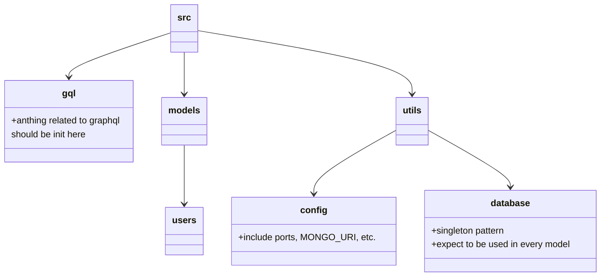

# SciQuel-Server
SciQuel's backend 

## Use with Docker Compose
Run these command asynchronously and rerun every developing cycle
```
docker-compose build
docker-compose up
docker-compose down
```

## Normal Use
Navigate to `src` and run `npm start` to start the server with `nodemon`

